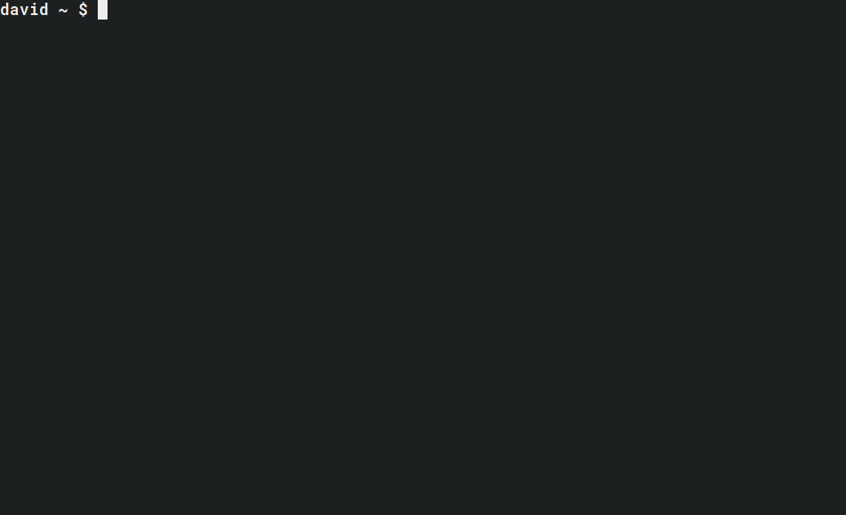

# MangaReaderScraper

Search and download manga from the command line, save as PDF or CBZ, optionally
bundle into Kindle-ready MOBI volumes, and optionally upload to cloud storage.



> **A note on this fork.** This is a personal, actively-maintained fork of
> [superDross/MangaReaderScraper](https://github.com/superDross/MangaReaderScraper)
> (which is itself deprecated). Manga sites change their markup, move behind
> Cloudflare, or shut down without warning, so **any given source can break at
> any time**. When one does, the [probe tooling](docs/adding-a-source.md) is
> there to help you re-point or rewrite its parser. Use responsibly and at a
> polite request rate.

## Supported sources

`--source` accepts any of the registered sites:

```
mangabuddy  mangafast  mangafire  mangago  mangakaka
manganato   manganelo  mangapark  mangareader
```

Availability varies over time (see the note above). `mangafire` is the most
actively maintained parser. Adding a new source is documented in
[docs/adding-a-source.md](docs/adding-a-source.md).

## Install

This fork is developed with [uv](https://docs.astral.sh/uv/) and pinned to
Python 3.13 (via `.python-version`).

```bash
git clone https://github.com/qam4/MangaReaderScraper
cd MangaReaderScraper

# Create the venv and install runtime + dev deps.
# Add the optional cloud-upload backends with the `upload` extra.
uv sync --extra upload
```

Run the CLI through uv:

```bash
uv run manga-scraper --help
```

Common dev commands:

```bash
uv run pytest                          # tests
uv run mypy scraper                    # type check
uv run ruff check ./scraper ./tests    # lint
uv run ruff format ./scraper ./tests   # format
```

## Quick start

Search for a series, pick it from the table, then choose what to download:

```
$ uv run manga-scraper --search dragon ball

+----+---------------------------------+-----------------+-------------+
|    | Title                           |   Latest Volume | Source      |
|----+---------------------------------+-----------------+-------------|
|  1 | Dragon Ball: Episode of Bardock |               3 | mangareader |
|  2 | Dragon Ball SD                  |              35 | mangareader |
|  3 | DragonBall Next Gen             |               4 | mangareader |
|  4 | Dragon Ball                     |             520 | mangareader |
|  5 | Dragon Ball Z - Rebirth of F    |               3 | mangareader |
|  6 | Dragon Ball Super               |              62 | mangareader |
+----+---------------------------------+-----------------+-------------+
Select manga number

>> 6

Dragon Ball Super has been selected for download.
Which volume(s) do you want to download (Enter alone to download all volumes)?

>> 1-25 33 56
```

Or skip the menu and download a series directly by its url slug:

```bash
# All chapters of Dragon Ball
uv run manga-scraper --manga dragon-ball

# Just chapter 2 of Final Fantasy XII
uv run manga-scraper --manga final-fantasy-xii --volumes 2

# Dragon Ball Super chapters 3-7 and 23, from a specific source, as CBZ
uv run manga-scraper --manga dragon-ball-super --volumes 3-7 23 --source mangafire --filetype cbz
```

If `--manga <slug>` finds nothing, the tool automatically falls back to a
`--search` for that term so you can pick the right entry.

## Selecting chapters

The `--volumes` argument (and the interactive prompt) is **chapter-number
based**, not positional. You can mix single chapters and ranges:

```
1-25 33 56     # chapters 1 through 25, plus 33 and 56
```

- Ranges are inclusive and resolved against the series' real chapter list, so
  they tolerate gaps and span decimal chapters (e.g. a `10-12` range will pick
  up a `10.5` if it exists).
- Press **Enter** alone at the prompt to download **all** chapters.
- A selector that matches nothing is skipped with a warning rather than
  aborting the run.

Some sites use opaque chapter slugs (no number in the url). For those, selection
falls back to **positional** order (1 = first listed chapter), since there is no
chapter number to match against.

## CLI reference

```
usage: manga-scraper [-h] [--manga [MANGA ...]] [--search [SEARCH ...]]
                     [--volumes VOLUMES [VOLUMES ...]] [--output OUTPUT]
                     [--filetype {pdf,cbz}]
                     [--source {mangabuddy,mangafast,mangafire,mangago,mangakaka,manganato,manganelo,mangapark,mangareader}]
                     [--upload {dropbox,pcloud,mega}]
                     [--override_name OVERRIDE_NAME] [--remove] [--version]
                     [--bundle BUNDLE]
```

| Flag | Short | Description |
|------|-------|-------------|
| `--manga` | `-m` | Manga series name / url slug to download |
| `--search` | `-s` | Search the source and pick from a results table |
| `--volumes` | `-q` | Chapters to download (single, ranges, or a mix); omit for all |
| `--output` | `-o` | Directory to save downloads (defaults to config `manga_directory`) |
| `--filetype` | `-f` | `pdf` or `cbz` (defaults to config `filetype`) |
| `--source` | `-z` | Site to scrape from (defaults to config `source`) |
| `--upload` | `-u` | Upload to a cloud service: `dropbox` or `pcloud` |
| `--override_name` | `-n` | Rename the manga for all saved/uploaded files |
| `--remove` | `-r` | Delete local volumes after a successful upload (requires `--upload`) |
| `--bundle` | | Chapters per volume; bundles the download into MOBI (forces `cbz`) |
| `--version` | `-v` | Print the installed version |

> **Note:** `mega` appears in the `--upload` choices but the Mega backend is
> currently disabled — use `dropbox` or `pcloud`.

## Bundling to MOBI (`--bundle`)

The `--bundle` option groups chapters into volumes and converts each to **MOBI**
(preferred over EPUB for Kindle manga quality). This requires extra setup beyond
the base install, because it shells out to a patched Kindle Comic Converter:

1. **Fetch the KCC fork** (a git submodule -- a fork patched for correct
   multithreading / tmp-folder handling that upstream KCC lacks):
   ```bash
   git submodule update --init
   ```
2. **Install it editable** so the `kcc-c2e` CLI is on your PATH:
   ```bash
   uv pip install -e kcc/
   ```
3. **kindlegen** does the final CBZ/EPUB -> MOBI step. Amazon discontinued and
   no longer distributes it, so a Windows build (`kindlegen.exe`) is vendored at
   the repo root. On other platforms you must supply your own `kindlegen` on
   PATH.

Without these, `--bundle` raises a clear error (it never silently produces
nothing). Plain PDF/CBZ downloads need none of this.

Example — download a series as CBZ and bundle every 10 chapters into a MOBI:

```bash
uv run manga-scraper --manga dragon-ball-super --bundle 10
```

## Config

The default config file lives at `$HOME/.config/mangascraper.ini` and is created
on first run:

```ini
[config]

# directory to save downloaded files to
manga_directory = /home/dir/Download

# directory to save bundled files to
manga_bundle_directory = /home/dir/Manga

# default website to download from
source = mangareader

# default filetype to store mangas as
filetype = pdf

# root cloud directory to upload the manga to
upload_root = /
```

## Uploading

Cloud upload backends require the `upload` extra (`uv sync --extra upload`) and
credentials in the config file.

### Dropbox

Follow this [guide](https://blogs.dropbox.com/developers/2014/05/generate-an-access-token-for-your-own-account/)
to create a token, then add it to `~/.config/mangascraper.ini`:

```ini
[dropbox]
token = hdkd87799jjjj
```

### pCloud

Add your email and password to the config file:

```ini
[pcloud]
email = email@email.com
password = notapassword123
```

## How fetching works (briefly)

Network access goes through pluggable fetcher backends
(`scraper/fetchers.py`):

- **curl_cffi** (default) — speaks the `requests` API but presents a real Chrome
  TLS fingerprint, which transparently clears the fingerprint-based blocking
  that plain `requests` trips on many sites.
- **requests** — a lightweight fallback.
- **cloudscraper** — for Cloudflare's JS interstitial.
- **nodriver** (real browser) — for JS-rendered pages and search results that
  only populate after scripts run.

A parser declares which backend it needs. When a site stops working or you are
adding a new one, the **probe tool** can tell you which backend a page requires
and surface candidate selectors/endpoints — see
[docs/adding-a-source.md](docs/adding-a-source.md).

## Adding or fixing a source

See [docs/adding-a-source.md](docs/adding-a-source.md) for the full workflow,
including the `python -m scraper.probe` helper for inspecting a site's structure
and deciding how to fetch it.
